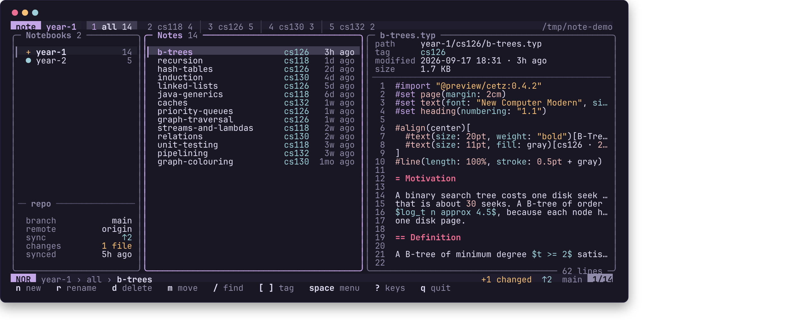
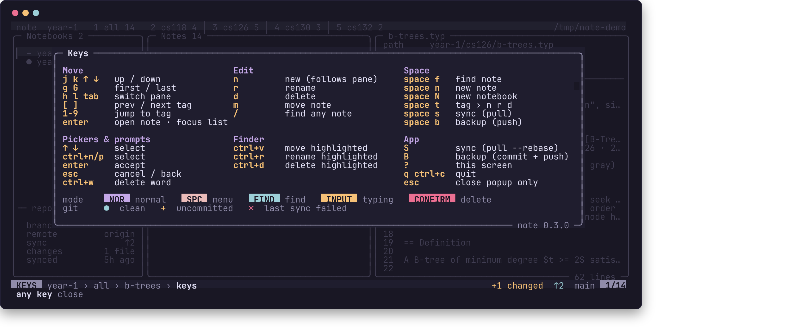
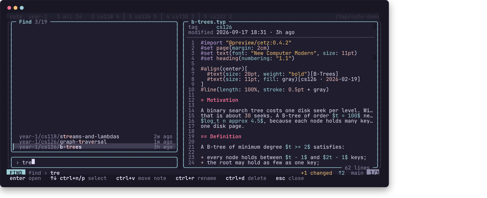
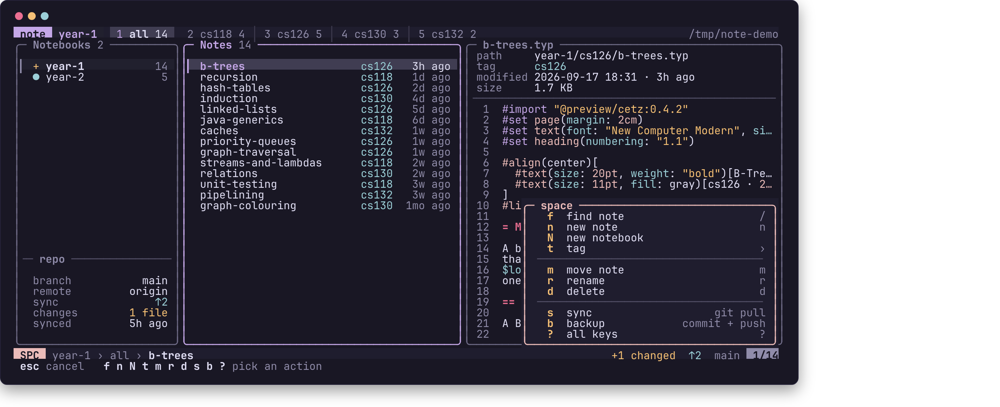
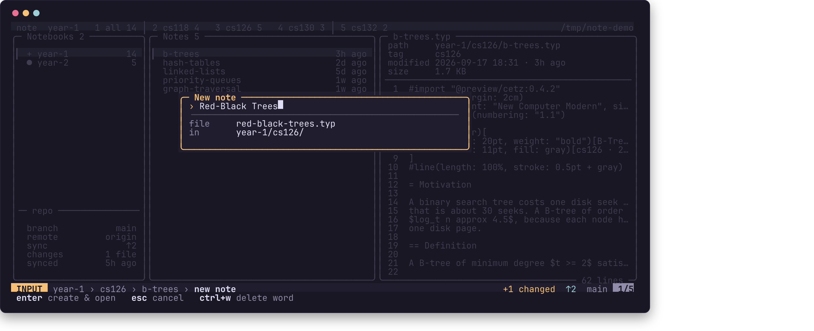
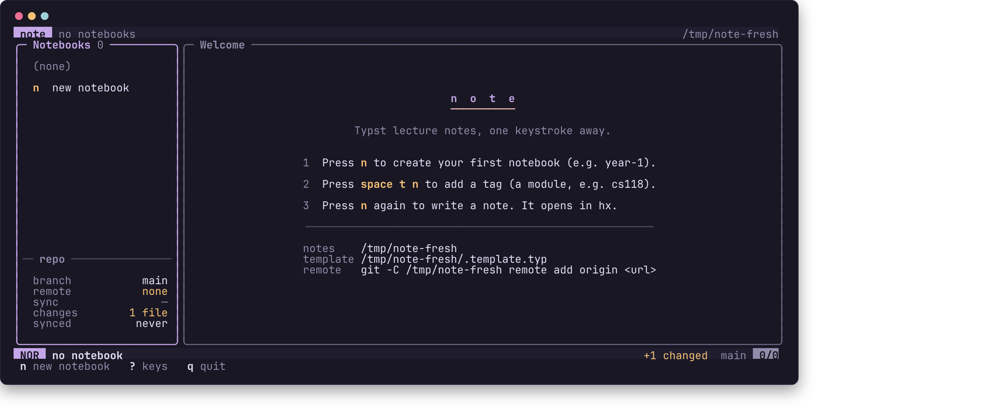
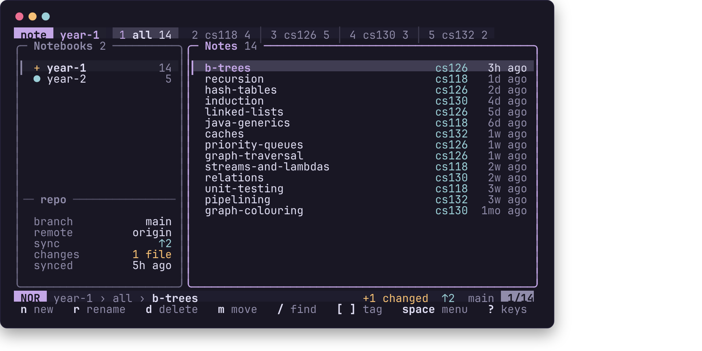

# note-tui

A keyboard-driven TUI for Typst lecture notes. It installs as the `note` command.

Notes are plain `.typ` files under `~/Documents/notes/<notebook>/<tag>/<name>.typ`, so the tree on disk is exactly what you see on screen: notebooks group tags, tags group notes, and a note's tag *is* its parent directory. Nothing in the interface is a database — renaming a tag renames a folder.



Open a note and `note` hands the terminal to your editor (Helix by default) with a live Typst preview beside it, served by Helix's own tinymist language server in a Helium app window. Quit the editor and you land back here. See [Helix setup](#helix-setup), which the preview depends on.

## Contents

- [The interface](#the-interface) · [Keys](#keys) · [Finding notes](#finding-notes) · [The space menu](#the-space-menu)
- [Creating and changing notes](#creating-and-changing-notes) · [Small terminals](#small-terminals)
- [Requirements](#requirements) · [Command line](#command-line) · [Configuration](#configuration) · [Template](#template)
- [Helix setup](#helix-setup) · [Sync](#sync)

## The interface

The screen is one keyboard surface, borrowed in equal parts from Helix, Neovim and a tiling multiplexer:

**Tab bar.** The notebook you are in, then its tags as numbered tabs — `1 all` plus one per tag, each with its note count. Press the number to jump, `[` and `]` to walk. When the tags outrun the width they collapse into a `+3 ›` marker rather than shrinking.

**Notebooks.** The notebook list with a note count and a git mark each: `●` committed, `+` uncommitted changes, `✗` the last sync failed. The mark is a glyph, not just a colour. Underneath, a repo panel: branch, remote, how far ahead or behind you are, how many files have changed, and when you last fetched.

**Notes.** Newest first, with the tag (in the `all` tab) and an age. The focused pane has an iris border and its selection is brighter; the unfocused pane keeps a dimmer bar so you never lose your place.

**Preview.** The selected file: path, tag, modified time, size, then the source with line numbers and Typst-aware highlighting — headings, `$math$`, `#functions`, strings, comments.

**Statusline.** A Helix-style mode pill (`NOR`, `SPC`, `FIND`, `INPUT`, `CONFIRM`, `KEYS`), a breadcrumb of where you are, then git state and your position in the list. Messages appear here and last until the next keypress.

**Hint line.** The keys that work *right now*, changing with the mode. Hints are dropped whole when the terminal is narrow — never cut in half.

## Keys

Press `?` for the full list, generated from the same table the keys are bound from, so it cannot drift.



| Key | Action |
|---|---|
| `j` `k` `↑` `↓` | Move in the focused pane |
| `g` `G` | First / last |
| `tab` `h` `l` | Switch between the notebooks and notes panes |
| `[` `]` | Previous / next tag tab |
| `1`–`9` | Jump straight to a tag tab |
| `enter` | Focus the notes (from the sidebar), or open the note |
| `n` | New — a notebook in the sidebar, a note in the list |
| `r` `d` `m` | Rename, delete, move |
| `/` | Find any note, anywhere |
| `space` | The menu (below) |
| `S` `B` | Sync (`git pull --rebase`) / backup (commit + push) |
| `?` | All keys |
| `q` `ctrl+c` | Quit |
| `esc` | Close a popup — **never** quits |

## Finding notes

`/` searches every note in every notebook at once. Results are fuzzy-matched with the hit characters picked out, the best match sits directly above the prompt, and the preview follows the selection.



From the finder, `enter` opens, and `ctrl+v` / `ctrl+r` / `ctrl+d` move, rename or delete the highlighted note without leaving the search.

## The space menu

`space` opens a which-key menu in the corner. It annotates the keyboard rather than taking over the screen, so the panes behind it stay readable — the only popup that doesn't dim what's underneath.



`space t` opens the tag submenu (`n` new, `r` rename, `d` delete), and `backspace` steps back to the root.

## Creating and changing notes

Creating a note asks only what it has to. With a tag tab active it goes straight to the title; only the ambiguous `all` tab stops to ask which tag, and then only when there is more than one. The prompt shows what the title will become on disk as you type, so the slugging is never a surprise.



`enter` creates the file from your template and opens it. Renaming and moving are the same operations on disk as anywhere else in the tree — because a tag is a directory, `m` is how you retag a note after the fact.

Deleting always asks, lists what goes with it, and reminds you that committed notes can be recovered from git. Only `y` deletes; `enter` deliberately does nothing.

On a fresh install there is nothing to list, so the first screen tells you where things live and what to press:



## Small terminals

The layout has three states and picks one from the width: three panes at 110 columns or more, notebooks and notes from 70, and the note list alone below that. Nothing wraps or overlaps; panes are dropped whole, and the hint line drops hints it can't fit.



## Requirements

The following programs must be on your `PATH`:

- [`typst`](https://typst.app/) — Typst compiler
- [`tinymist`](https://github.com/Myriad-Dreamin/tinymist) — Typst language server and preview server
- [`hx`](https://helix-editor.com/) — Helix editor
- [`helium`](https://github.com/Alex-Shand/helium) — browser launcher used for the preview window

A terminal with truecolor support and a font covering box-drawing characters (any Nerd Font will do). The interface takes its colours from the terminal's own scheme: text and background are the terminal defaults, accents come from its ANSI palette, and the in-between shades are blended from the background and foreground it reports (OSC 10/11). Terminals that don't answer those queries get a plainer fallback.

Alternatively, use the included Nix flake to get a reproducible environment:

```bash
nix build          # builds ./result/bin/note
nix develop        # drops you into a shell with go, typst, and tinymist
```

The dev shell intentionally omits `hx` and `helium` — install those through your regular profile (they're editor/browser choices, not build dependencies).

Add `result/bin` to your `PATH`, or copy `result/bin/note` to `~/.local/bin`.

## Command line

There are only two invocations — everything else lives in the TUI.

| Command | Description |
|---|---|
| `note` | Open the TUI |
| `note --version`, `note -v` | Print the version and exit |

## Configuration

`note` reads `~/.config/note/config.toml` on startup. All keys are optional; the defaults are shown below.

```toml
notes_dir       = "~/Documents/notes"
editor          = "hx"
preview         = "helium --app={url} --user-data-dir={profile} --no-first-run --no-default-browser-check --disable-extensions"
preview_url     = "http://127.0.0.1:23635"
preview_profile = "~/.cache/note/preview-profile"
```

- **`notes_dir`** — root directory for all notebooks and notes.
- **`editor`** — command used to open a note. Must accept a file path as its last argument.
- **`preview`** — command used to open the live preview window. `{url}` is replaced with the page `note` serves in front of `preview_url` (see [How a note opens](#how-a-note-opens)) and `{profile}` with this session's profile directory.
- **`preview_url`** — where tinymist serves the preview. **Must match `--data-plane-host` in your Helix config** (see below); tinymist serves the preview page from that same address.
- **`preview_profile`** — where `note` keeps browser profiles. Each editing session gets a fresh profile underneath it, which is what lets `note` close the preview window when you quit the editor: a Chromium-based browser launched against a profile another instance already holds hands its window over and exits immediately, leaving a window nothing can close. Profiles left behind by a crashed session are reclaimed on the next start. If you point `preview` at a browser of your own, keep `{profile}` in the command, and keep `--disable-extensions` if your browser loads extensions on every launch: on a fresh profile they reinstall each time, and some (Bitwarden, for one) open a welcome window when they do.

## Template

The note template lives at `~/Documents/notes/.template.typ` and is created automatically on first run. Edit it to customise how new notes look.

Supported placeholders:

| Placeholder | Replaced with |
|---|---|
| `{{title}}` | The note title you enter at creation time |
| `{{tag}}` | The tag (module folder) the note belongs to |
| `{{date}}` | The creation date in `YYYY-MM-DD` format |

The default template imports [typdraw 0.1.0](https://typst.app/universe/package/typdraw) so diagrams are available out of the box without any extra setup.

## Helix setup

This is **required**, not optional — the live preview is owned by Helix's tinymist language server, not by `note`. Add the following to `~/.config/helix/languages.toml`:

```toml
[[language]]
name = "typst"
language-servers = ["tinymist"]
formatter = { command = "typstyle" }

[language-server.tinymist]
command = "tinymist"

[language-server.tinymist.config.preview.background]
enabled = true
args = ["--data-plane-host=127.0.0.1:23635", "--invert-colors=never"]
```

This requires `tinymist` and (optionally) `typstyle` on your `PATH`. Both are available in nixpkgs.

Two details matter:

- **`--data-plane-host` must match `preview_url`** in `~/.config/note/config.toml`. tinymist serves the preview page and the document stream from this one address, so `note` knows where to point the preview window without guessing a port.
- **Don't add `--open`.** That flag makes tinymist launch your *default* browser, which would give you a second window next to the one `note` opens.

Because the language server holds the buffer, the preview updates as you type — not just on save — and clicking in the preview moves your cursor in Helix.

### How a note opens

1. `note` launches Helix in the foreground.
2. Helix starts tinymist, which starts the preview server on `preview_url`.
3. `note` waits for that address to accept connections, then runs the `preview` command to open the window. The window opens a small proxy `note` runs in front of tinymist, at `http://127.0.0.1:<port>/note-preview`, which repaints tinymist's gray backdrop in your terminal's background colour. That backdrop is all you see for the second or two tinymist's page takes to boot, so it now loads as a blank pane in your own colours.
4. Quitting Helix closes the preview window and returns you to the TUI.

If the preview server never appears, `note` says so in the status line and you still get your editor — editing is never blocked by a broken preview.

### Keeping focus in the terminal

Chromium-based browsers name an `--app` window after its URL and ignore `--class`, so the preview window's class is `chrome-127.0.0.1__note-preview-Default`. To have it open without taking focus from the terminal, add a window rule. On Hyprland:

```lua
hl.window_rule({ match = { class = "chrome-127.0.0.1__note-preview-.*" }, no_initial_focus = true })
```

or, in hyprlang, `windowrule = noinitialfocus, class:^(chrome-127\.0\.0\.1__note-preview-.*)$`.

## Sync

`~/Documents/notes` is a git repository, initialised on first run. `B` and `S` delegate to git, and the sidebar's repo panel shows the result without your having to leave the TUI. Set up a remote once:

```bash
git -C ~/Documents/notes remote add origin <url>
```

After that, `B` commits all changes and pushes, and `S` pulls the latest commits with `git pull --rebase`. Without a remote, `B` still commits locally and says so. Conflicts are left for you to resolve with standard git tooling.
